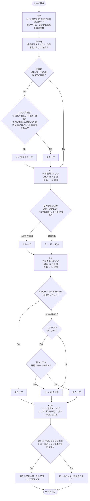
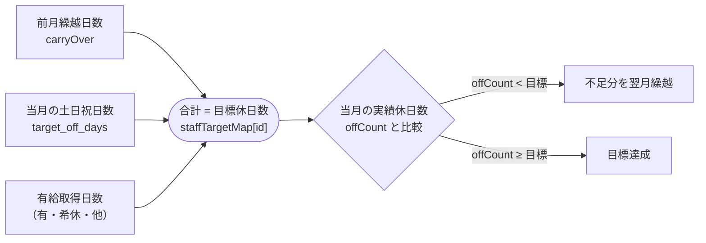

# シフト生成アルゴリズム フロー図

> `shift-rules.md` のアルゴリズム（Step A〜F）を図示したものです。

---

## メインフロー

```mermaid
flowchart TD
    START([🚀 シフト生成開始]) --> A1

    subgraph STEP_A["Step A｜ハード制約の事前確定（フリーズ）"]
        A1["A-1 前月持ち越し\n前月末夜勤 → 1日目を明け・翌々日を公\n※連続夜勤の場合は 明→夜→明→公→公"]
        A1 --> A2
        A2["A-2 休暇リクエスト\n有給・希望休・特別休暇 を frozenCells に登録"]
        A2 --> A3
        A3["A-3 ハード定休日\noff_days_constraint=hard の曜日・祝日を 公 でフリーズ"]
        A3 --> A4
        A4["A-4 ソフト定休日\nフリーズしない。no_extra_off 制約を条件付きで追加\n（allow_extra_off_days=false かつ max_night_shifts=0 の場合のみ）"]
    end

    A4 --> B_START

    subgraph STEP_B["Step B｜夜勤割り当て"]
        B_START{各日・各スタッフ\n候補チェック}
        B_START -->|空きセル\n夜勤残枠あり\n翌日・翌々日も確保可| B_ASSIGN
        B_START -->|条件不満| B_SKIP[スキップ]
        B_ASSIGN["夜・明・公 を順番にフリーズ"]
    end

    B_ASSIGN --> C_START
    B_SKIP --> C_START

    subgraph STEP_C["Step C｜シニア日勤優先確保（平日のみ）"]
        C_START{平日に\nシニアが日勤ゼロか？}
        C_START -->|Yes| C_ASSIGN["シニアを日勤に強制割り当て\n（ペア制約・連続勤務を考慮）"]
        C_START -->|No| C_SKIP[スキップ]
    end

    C_ASSIGN --> D_START
    C_SKIP --> D_START

    subgraph STEP_D["Step D｜一般日勤で最低人数を充足"]
        D_START["候補ソート順\n① ハード定休スタッフ優先\n② シニアは後回し\n③ 公休数が多い順\n④ 日勤数が少ない順"]
        D_START --> D_ASSIGN["日勤を最低人数に達するまで割り当て"]
    end

    D_ASSIGN --> E0_START

    subgraph STEP_E["Step E｜休日数調整"]
        E0_START["E-0｜allow_extra_off_days=false スタッフ\n非フリーズ・非定休日の 公 → 日 に強制変換"]
        E0_START --> ES_START
        ES_START["E-swap｜過剰↔不足スタッフのスワップ\n同日に 公（過剰）↔ 日（不足）を交換\ndayCount が変わらないため最低人数制約を維持"]
        ES_START --> E1_START
        E1_START["E-1｜過剰休日スタッフの 公→日 変換\noffCount > 目標 のスタッフの 公 を 日 に変換\n※シニアカバレッジチェックなし（既知の課題）"]
        E1_START --> E2_START
        E2_START["E-2｜不足休日スタッフの 日→公 変換\ndayCount > minRequired の余裕がある日のみ変換\nシニアの場合は他シニアのカバレッジを確認"]
        E2_START --> E2B_START
        E2B_START["E-2b｜シニア専用 日↔公 スワップ\n非シニアの 公 → 日 / シニアの 日 → 公 に交換\nシニアカバレッジのロールバックあり"]
    end

    E2B_START --> F_START

    subgraph STEP_F["Step F｜翌月繰越計算"]
        F_START["shortfall = 目標休日数 − 実績休日数"]
        F_START --> F_CARRY["不足分を翌月 carryOver に加算"]
    end

    F_CARRY --> END([✅ シフト生成完了])
```



---

## Step E 詳細フロー



---

## スタッフ候補チェック（Step B: 夜勤）

```mermaid
flowchart TD
    IN([夜勤候補チェック開始]) --> C1
    C1{grid[id][day] == 空き？} -->|No| NG([❌ 不可])
    C1 -->|Yes| C2
    C2{frozenCells に含まれない？} -->|No| NG
    C2 -->|Yes| C3
    C3{夜勤回数 < max_night_shifts？} -->|No| NG
    C3 -->|Yes| C4
    C4{前日が 夜 / 明 でない？} -->|No| NG
    C4 -->|Yes| C5
    C5{2日前が 夜 でない？\n※連続夜勤パターンは例外} -->|No| NG
    C5 -->|Yes| C6
    C6{連続勤務制約を超えない？} -->|No| NG
    C6 -->|Yes| C7
    C7{翌日が 空き or 非フリーズ公？} -->|No| NG
    C7 -->|Yes| C8
    C8{翌々日が 空き or 非フリーズ公？} -->|No| NG
    C8 -->|Yes| OK([✅ 夜勤割り当て可])
```

---

## 目標休日数の計算


