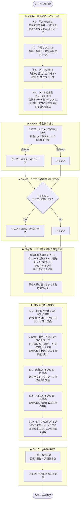
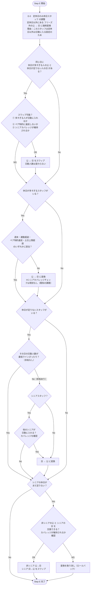
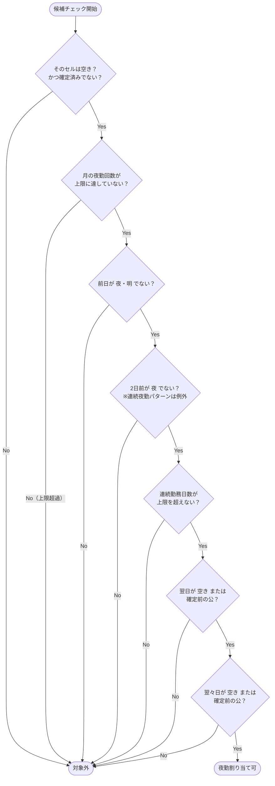
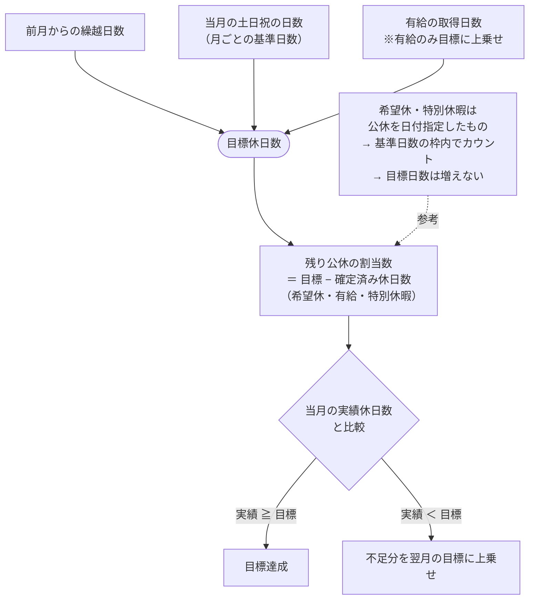

# シフト生成アルゴリズム フロー図

> `shift-rules.md` のアルゴリズム（Step A〜F）を図示したものです。

---

## 用語説明

| 図中の表現 | 意味 |
|-----------|------|
| フリーズ | 以降のステップで上書き不可にすること |
| 過剰スタッフ | 実績休日数が目標を超えているスタッフ |
| 不足スタッフ | 実績休日数が目標に届いていないスタッフ |
| 定休日のみ休日スタッフ | スタッフ設定で「定休日以外には公休を入れない」に設定されている人 |
| シニア | 師長・主任（役職）を指す |
| カバレッジ | 平日に必ずシニアが1人以上日勤に入っている状態 |

---

## 全体フロー

---

## Step E 詳細フロー

---

## 夜勤割り当て 候補チェック（Step B）

---

## 目標休日数の算出と繰越

