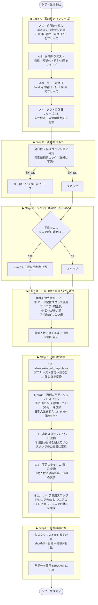
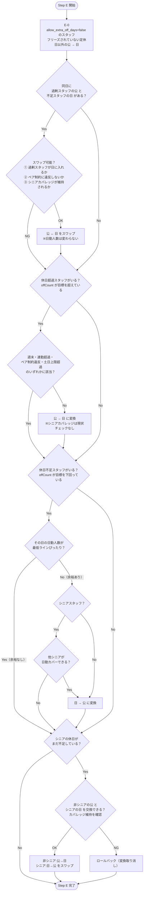
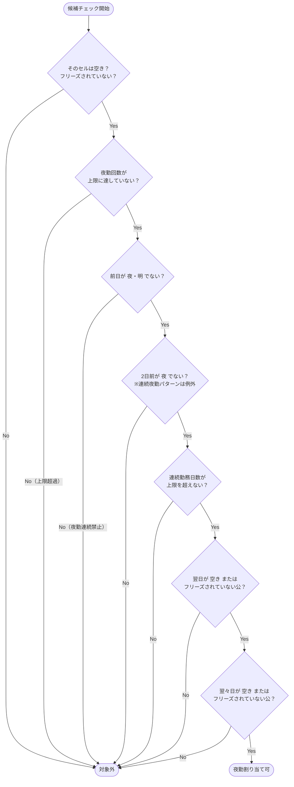
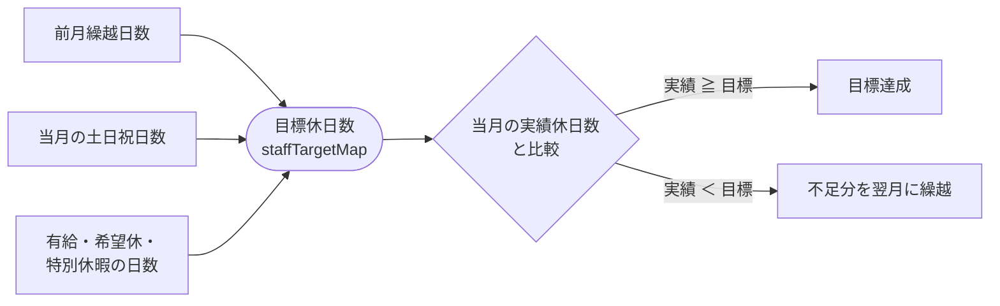

# シフト生成アルゴリズム フロー図

> `shift-rules.md` のアルゴリズム（Step A〜F）を図示したものです。

---

## 全体フロー

```mermaid
flowchart TD
    START([シフト生成開始])

    START --> A1

    subgraph SA["▶ Step A　事前確定（フリーズ）"]
        A1["A-1　前月持ち越し\n前月末の夜勤者を処理\n→ 1日目:明け　翌々日:公　をフリーズ"]
        A2["A-2　休暇リクエスト\n有給・希望休・特別休暇 をフリーズ"]
        A3["A-3　ハード定休日\nhard 定休曜日・祝日 を 公 でフリーズ"]
        A4["A-4　ソフト定休日\nフリーズなし\n条件付きで公休禁止制約を追加"]
        A1 --> A2 --> A3 --> A4
    end

    A4 --> B1

    subgraph SB["▶ Step B　夜勤割り当て"]
        B1["全日程 × 全スタッフを順に確認\n夜勤候補チェック（詳細は下図）"]
        B2["夜・明・公 を3日分フリーズ"]
        B1 -->|"条件OK"| B2
        B1 -->|"条件NG"| B3[スキップ]
    end

    B2 --> C1
    B3 --> C1

    subgraph SC["▶ Step C　シニア日勤確保（平日のみ）"]
        C1{"平日なのに\nシニアが日勤ゼロ？"}
        C2["シニアを日勤に強制割り当て"]
        C1 -->|"Yes"| C2
        C1 -->|"No"| C3[スキップ]
    end

    C2 --> D1
    C3 --> D1

    subgraph SD["▶ Step D　一般日勤で最低人数を充足"]
        D1["候補を優先度順にソート\n① ハード定休スタッフ優先\n② シニアは後回し\n③ 公休が多い順\n④ 日勤が少ない順"]
        D2["最低人数に達するまで日勤に割り当て"]
        D1 --> D2
    end

    D2 --> E0

    subgraph SE["▶ Step E　休日数調整"]
        E0["E-0　allow_extra_off_days=false\n非フリーズ・非定休日の公 → 日 に強制変換"]
        ES["E-swap　過剰↔不足スタッフのスワップ\n同じ日に 公（過剰） と 日（不足） を交換\n日勤人数を変えないまま休日数を均す"]
        E1["E-1　過剰スタッフの 公→日 変換\n休日数が目標を超えているスタッフの公を日に変換"]
        E2["E-2　不足スタッフの 日→公 変換\n日勤人数に余裕がある日のみ変換"]
        E2B["E-2b　シニア専用スワップ\n非シニアの公 と シニアの日 を交換してシニアの休日を確保"]
        E0 --> ES --> E1 --> E2 --> E2B
    end

    E2B --> F1

    subgraph SF["▶ Step F　翌月繰越計算"]
        F1["各スタッフの不足日数を計算\nshortfall = 目標 − 実績休日数"]
        F2["不足分を翌月 carryOver に加算"]
        F1 --> F2
    end

    F2 --> END([シフト生成完了])
```

---

## Step E 詳細フロー

```mermaid
flowchart TD
    IN([Step E 開始]) --> E0

    E0["E-0\nallow_extra_off_days=false のスタッフ\nフリーズされていない定休日以外の公 → 日"]
    E0 --> ES

    ES{"同日に\n過剰スタッフの公 と\n不足スタッフの日 がある？"}
    ES -->|"Yes"| ES2{"スワップ可能？\n① 過剰スタッフが日に入れるか\n② ペア制約に違反しないか\n③ シニアカバレッジが維持されるか"}
    ES2 -->|"OK"| ES3["公 ↔ 日 をスワップ\n※日勤人数は変わらない"]
    ES2 -->|"NG"| E1
    ES3 --> E1
    ES -->|"No"| E1

    E1{"休日超過スタッフがいる？\noffCount が目標を超えている"}
    E1 -->|"Yes"| E1B{"週末・連勤超過・\nペア制約違反・土日上限超過\nのいずれかに該当？"}
    E1B -->|"Yes"| E2
    E1B -->|"No"| E1C["公 → 日 に変換\n※シニアカバレッジは現状チェックなし"]
    E1C --> E2
    E1 -->|"No"| E2

    E2{"休日不足スタッフがいる？\noffCount が目標を下回っている"}
    E2 -->|"Yes"| E2B{"その日の日勤人数が\n最低ラインぴったり？"}
    E2B -->|"Yes（余裕なし）"| E2BB
    E2B -->|"No（余裕あり）"| E2C{"シニアスタッフ？"}
    E2C -->|"Yes"| E2D{"他シニアが\n日勤カバーできる？"}
    E2D -->|"Yes"| E2E["日 → 公 に変換"]
    E2D -->|"No"| E2BB
    E2C -->|"No"| E2E
    E2E --> E2BB
    E2 -->|"No"| E2BB

    E2BB{"シニアの休日が\nまだ不足している？"}
    E2BB -->|"Yes"| E2BC{"非シニアの公 と\nシニアの日 を交換できる？\nカバレッジ維持を確認"}
    E2BC -->|"OK"| E2BD["非シニア:公→日\nシニア:日→公 をスワップ"]
    E2BC -->|"NG"| E2BE["ロールバック（変換取り消し）"]
    E2BB -->|"No"| OUT

    E2BD --> OUT
    E2BE --> OUT

    OUT([Step E 完了])
```

---

## 夜勤割り当て 候補チェック（Step B）

```mermaid
flowchart TD
    IN([候補チェック開始]) --> C1

    C1{"そのセルは空き？\nフリーズされていない？"}
    C1 -->|"No"| NG([対象外])
    C1 -->|"Yes"| C2

    C2{"夜勤回数が\n上限に達していない？"}
    C2 -->|"No（上限超過）"| NG
    C2 -->|"Yes"| C3

    C3{"前日が 夜・明 でない？"}
    C3 -->|"No（夜勤連続禁止）"| NG
    C3 -->|"Yes"| C4

    C4{"2日前が 夜 でない？\n※連続夜勤パターンは例外"}
    C4 -->|"No"| NG
    C4 -->|"Yes"| C5

    C5{"連続勤務日数が\n上限を超えない？"}
    C5 -->|"No"| NG
    C5 -->|"Yes"| C6

    C6{"翌日が 空き または\nフリーズされていない公？"}
    C6 -->|"No"| NG
    C6 -->|"Yes"| C7

    C7{"翌々日が 空き または\nフリーズされていない公？"}
    C7 -->|"No"| NG
    C7 -->|"Yes"| OK([夜勤割り当て可])
```

---

## 目標休日数の算出と繰越

```mermaid
flowchart LR
    A["前月繰越日数"] --> SUM(["目標休日数\nstaffTargetMap"])
    B["当月の土日祝日数"] --> SUM
    C["有給・希望休・\n特別休暇の日数"] --> SUM

    SUM --> CMP{"当月の実績休日数\nと比較"}
    CMP -->|"実績 ≧ 目標"| OK["目標達成"]
    CMP -->|"実績 ＜ 目標"| NG["不足分を翌月に繰越"]
```
